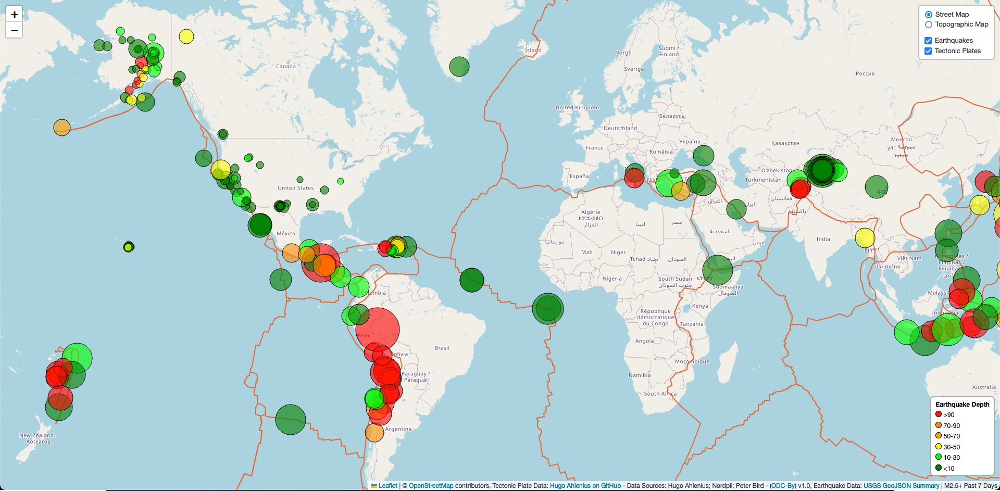

# leaflet-challenge
Mapping earthquake data with leaflet and D3 API calls, with dynamic formatting based on GeoJSON data received to show earthquake depth and magnitude.

## Work Credit/Citations
- I worked with fellow student Emilia Sanchez and adapted her code for the bubble formatting portion of the project.
- Implementing the Legend: ['Adding Leaflet legend?'](https://gis.stackexchange.com/questions/133630/adding-leaflet-legend) - Asked by Richard Butler Feb 9, 2015, Answered by Richard Butler Feb 10, 2015 -  GIS StackExchange
- Parts of the code used in daily activities were adapted into this project as well.

## Data Sources/Citations
All info here is available on the webpage in the attribution section:
- Street Map Data: © [OpenStreetMap](https://www.openstreetmap.org/copyright) contributors
- Topo Map Data: © [OpenStreetMap](https://www.openstreetmap.org/copyright) contributors, [SRTM](http://viewfinderpanoramas.org) | Map style: © [OpenTopoMap](https://opentopomap.org) ([CC-BY-SA](https://creativecommons.org/licenses/by-sa/3.0/))
- Tectonic Plate Data: [Hugo Ahlenius on GitHub](https://github.com/fraxen/tectonicplates) - Data Sources: Hugo Ahlenius; Nordpil; Peter Bird - ([ODC-By](https://opendatacommons.org/licenses/by/1-0/)) v1.0
- Earthquake Data: [USGS GeoJSON Summary](https://earthquake.usgs.gov/earthquakes/feed/v1.0/geojson.php) | M2.5+ Past 7 Days